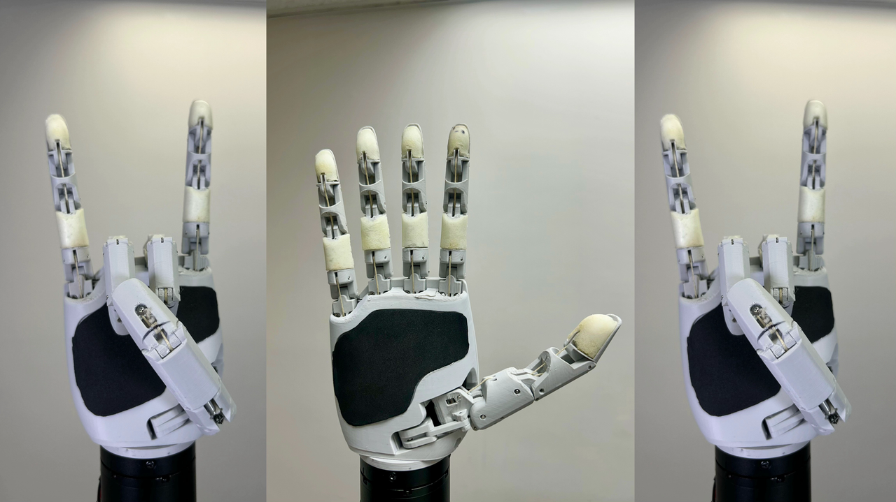
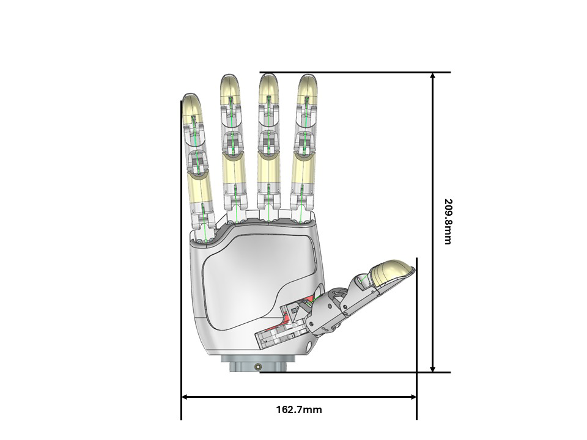
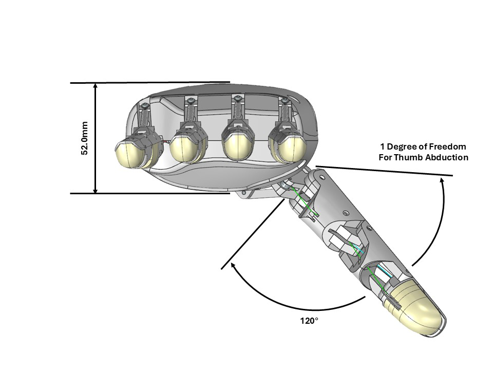
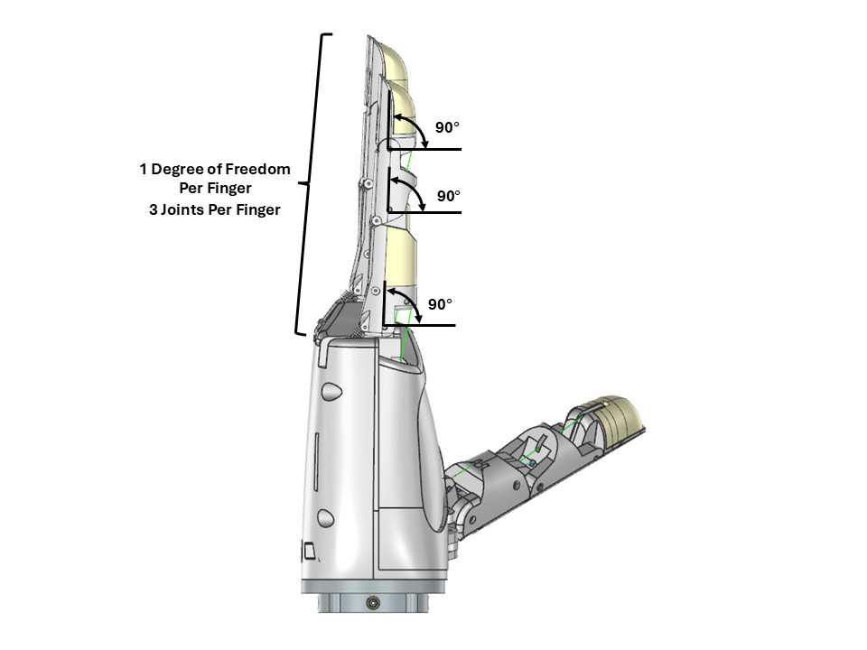
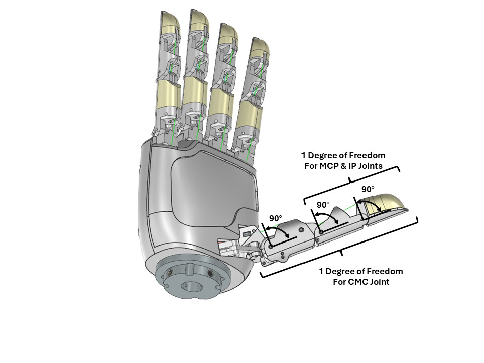
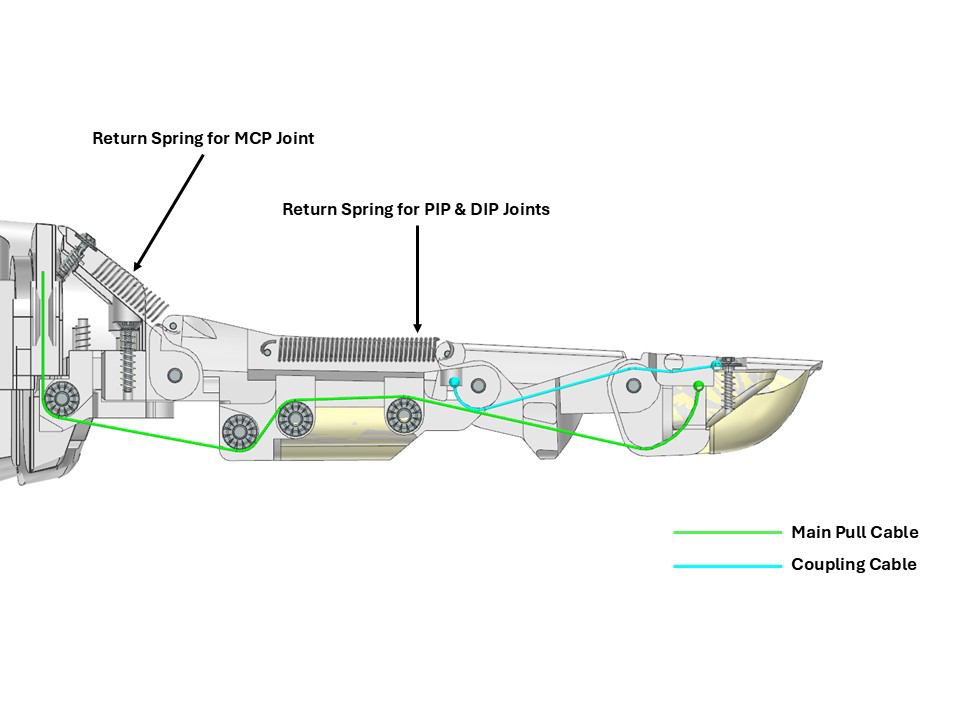
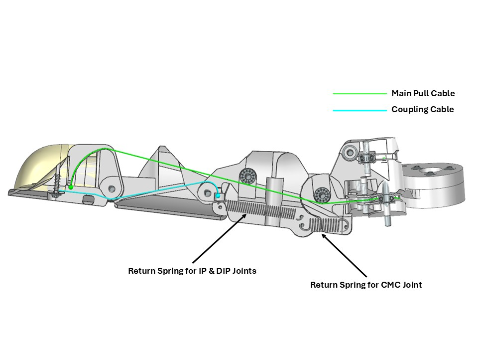
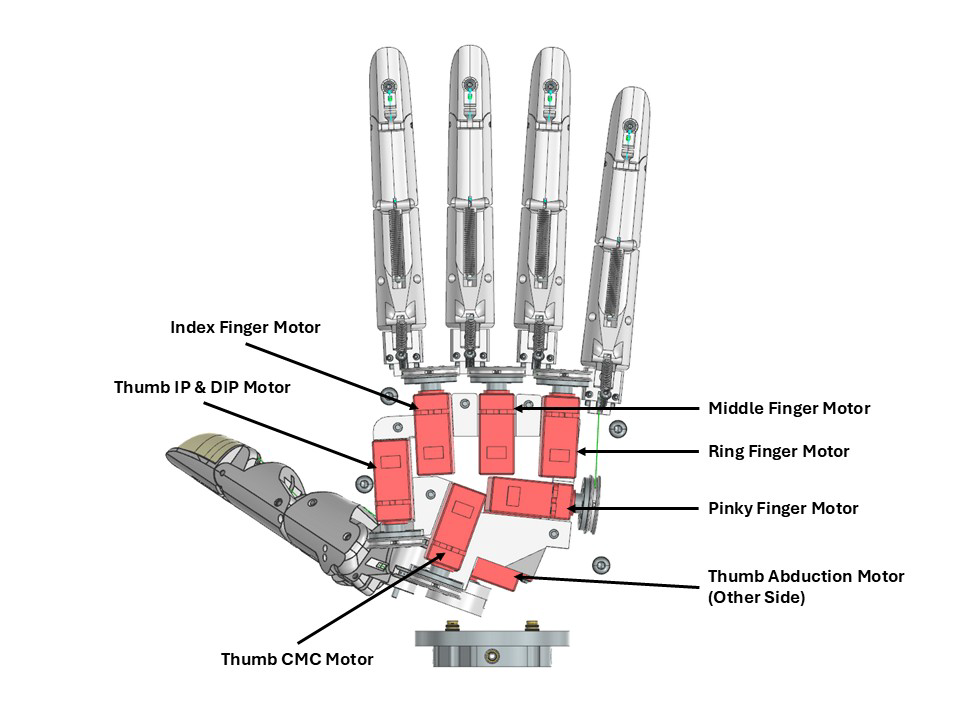

[](#license--tldr)

## License — TL;DR

- You **can** integrate Aero Hand units you purchase from TetherIA into **commercial robots and products** you sell.
- **Software (firmware & SDK):** Apache-2.0 — commercial use OK (with notices).
- **Design files (CAD/STEP/STL, drawings, BOM, docs):** CC BY‑NC‑SA 4.0 — **non‑commercial** only; derivatives must use the same license with attribution.
- Want to **manufacture/print parts** or **make your own hands** from our design files for commercial use (spares, kits, or clones)? → **Commercial manufacturing license required**.
- **Commercial licensing & volume buys:** see **LICENSE.md** (or email us at contact@tetheria.ai).

See [**LICENSE.md**](LICENSE.md) for definitions, examples, and contact details.

  
© 2025 TetherIA Inc. All rights reserved.



Aero Hand Open is an **open-source**, **tendon-driven** robotic hand designed and developed by TetherIA for dexterous manipulation research. Unlike expensive proprietary solutions, this hand focuses on **simplicity**, **reliability**, and **accessibility** by using standard 3D printing and off-the-shelf electronic components.

Each joint is optimized for mechanical efficiency through tendon actuation, enabling smooth and natural motion while maintaining a **lightweight** and **compact** design, making it perfect for research labs, educational institutions, and robotics enthusiasts who need an **affordable** yet **capable** manipulation platform.

> **📚 Learn More:** https://docs.tetheria.ai/  
> **🛒 Shop:** https://shop.tetheria.ai/


# Aero Hand Open features:
- 7 DoFs robotic hand with 5 fingers (16 joints in total)
- Tendon-driven architecture for smooth and natural motion
- Fully 3D-printed structure, modular and easy to assemble
- Lightweight design — **389 g**
- Affordable — complete kit for **$314 USD**
- Open-source hardware and firmware
- Independent Python SDK, and compatible with ESP32 and ROS2 systems


# Overview:















# Table of Contents:
- Resources
  - Bill of Materials (BOM)
  - CAD Files and 3D Models
  - PCB Design
  - Assembly Guide
  - Hardware Setup
  - SDK
  - ROS2 and Teleoperation
- Disclaimer
- Project Updates & Community
  - Updates History
  - FAQ
  - Contact

# Resources
## Bill of Materials (BOM)
The complete list of components required to build Aero Hand Open can be found here:

 [👉 Aero Hand Open – Bill of Materials](./hardware/Assembly/BOM.csv)

This document includes all mechanical, electronic, and printed parts — such as motors, tendons, bearings, fasteners, and 3D-printed components.

Each item is listed with its part number, vendor, quantity, and estimated cost to help you easily source or substitute parts.

## CAD Files and 3D Models
All CAD and 3D model files of Aero Hand Open are available in the [CAD](./hardware/CAD).

You can find both STEP and STL files for modification and direct 3D printing.

> CAD Files Notes:
> The absolute origin of the full assembly is at the MCP joint of middle finger

For quick setup, we also provide a “One-Click Print Pack”, which contains all parts with pre-oriented build angles optimized for print strength, surface quality, and minimal support usage.

Simply load the files into your slicer and start printing — no additional rotation or manual adjustment is required.

Printing Notes:
- Suggested Printer: Bambau Lab X1C/P1S
- Recommended material: PLA (for stiffness and dimensional accuracy)
- Suggested layer height: 0.2 mm (Nozzle Diameter 0.4mm)
- Support: Autogenerate is fine
- The hand design is fully modular — individual fingers can be printed and replaced independently
- Other information can be found in Assembly Documents

An online Onshape model is also available for quick viewing and part reference:

[👉 Aero Hand Open – Onshape Document](https://cad.onshape.com/documents/afc7e0ca7eb6d412ec8771f8/w/bc4d7e45e17e23d622d2bad2/e/1e3862db4d4df7d9dca6f286?renderMode=0&uiState=68e5abd64106f26dc459da44)

## Assembly Guide
The step-by-step assembly instructions for Aero Hand Open are provided in the following document:

[👉 Aero Hand Open – Assembly Guide](https://docs.tetheria.ai/docs/assembly)

This guide covers the entire build process, from mounting the actuators to routing the tendons and connecting the electronics. Each finger module can be assembled independently and attached to the palm afterward, allowing easier maintenance and quick replacement.

## PCB Design
The Aero Hand Open consists of two custom PCB boards: Board A and Board B. All design files - including Gerber files, KiCad project files, BOM, and CPL - are available in [PCB folder](./hardware/PCB/)

#### Board A
 - Features 8 Molex connectors for connecting all servos in the hand.
 - Includes a JST connector P3.96mm for outer wiring and fitting inside the hand enclosure.
 - Designed for compact integration and reliable servo connectivity.
#### Board B
 - Includes a JST connector and one Molex connector for testing individual servos and debugging.
 - Features a terminal block to connect a regulated 6V, 10A power supply for the servos.
 - Hosts the ESP32-S3 microcontroller with a USB-C port for:
      - Powering the ESP32-S3
      - Communication between PC and ESP32-S3
      - Interfacing with the hand
 - Board B is essential for diagnostics and safe power delivery.

## Hardware Setup
**Buy our custom PCBs** (described above) from our [website](https://shop.tetheria.ai/products/pcbs) for a **plug-and-play solution**. 

✅ **Benefits:**
- **Zero soldering required** - just plug and play
- **Professional quality** - tested and verified PCBs
- **Self-explanatory connections** - cable connections are straightforward
- **Maximum reliability** - optimized for all motor currents
- **Time-saving** - get your hand running in minutes, not hours

🔗 **[Order PCBs Now →](https://shop.tetheria.ai/products/pcbs)**


For more info please refer to here https://docs.tetheria.ai/docs/hardware_setup


## Software SDK
We provide basic introduction and usage here. A detailed introduction to SDK is included in the following folder.

 👉 [`sdk/README.md`](sdk/README.md)

### Installation: 
📦 Install via pip
```bash
pip install aero-hand-sdk
```
     
🧩 Install from source (editable mode)
Clone the repository to your local machine:
```bash
git clone https://github.com/TetherIA/aero-open-sdk.git
```
     
Navigate to the cloned repository directory:
```bash
cd aero-open-sdk
```

Install the package in editable mode:
```bash
pip install -e .
```

### One-Time Setup
When setting up your hand for the first time, our setup GUI helps you configure motor IDs and test motor connections.
After installation, launch the Setup GUI with:
```bash
aero-hand-gui
```

This provides an interactive interface to configure your hand.

### Sequencing Demo
The Sequencing Demo demonstrates how different finger motions can be combined into continuous, pre-defined sequences.

This script enables users to perform complex gestures — such as pinching, opening the palm, or making a peace sign — by automatically coordinating joint movements in a timed sequence.

You can find the example code in the SDK example folder. 

👉 [`sdk/examples/`](sdk/examples)

Once the SDK is installed and the serial port has been configured, you can run any of the example scripts directly using Python as follows:

```bash
python run_sequence.py
```
[🎥 Watch the demo](assets/sequence_square.mp4)

## ROS2 and Teleoperation
The Aero Hand Open integrates seamlessly with ROS2 humble for advanced robotics applications. The ROS2 package includes:

- **URDF models** for accurate robot simulation and visualization
- **Launch files** for easy integration with existing ROS2 workflows  
- **Teleoperation support** for real-time hand control
- **RViz configuration** for 3D visualization and debugging

Refer to the [`ros2/`](./ros2/) folder for complete setup instructions and examples.

# Disclaimer
Aero Hand Open is an open-source research prototype intended for educational and experimental purposes only.

While every effort has been made to ensure build accuracy and functionality, this design has not been validated for prolonged or heavy-duty use.

Users should exercise caution when assembling, operating, or modifying this device. TetherIA Inc. and its contributors shall not be held liable for any personal injury, property damage, or other losses resulting from the use, misuse, or modification of this design. By using this project, you acknowledge and accept full responsibility for any associated risks.

Important Notes:
- 3D-printed parts may exhibit tolerance variations depending on printer and material settings.
- The tendon-driven mechanism requires regular tension adjustment to maintain consistent motion.
- Overloading the joints or applying excessive torque may cause mechanical deformation or servo damage.
- This project is provided as is, without any warranty or guarantee of fitness for a particular purpose.

We encourage the community to share improvements, feedback, and modifications through pull requests or GitHub discussions.

Your contributions will help make Aero Hand Open more reliable and versatile for the entire robotics community.

# Project Updates & Community
## Updates History
- 10/24/2025
  - Release hardware and ROS2 packages
- 10/13/2025
  - Product launched on all platforms

## FAQ
Q1: Can I modify and redistribute the Aero Hand Open design?

A: Yes, as long as it complies with the CC BY-NC-SA 4.0 license (non-commercial, attribution required, share alike).

Q2: What 3D printer and material do you recommend?

A: Any FDM printer with a ≥200×200 mm bed. PLA works best for strength and dimensional accuracy.

## Contact
For questions, feedback, or collaboration inquiries, please reach out to us through the following channels:

 🛒 Shop: [Aero Hand Open – TetherIA Store](https://shop.tetheria.ai/) 

 📚 Docs: [TetherIA Docs](https://docs.tetheria.ai/)

 📧 Email: support@tetheria.ai

 🌐 Website: [tetheria.ai](http://tetheria.ai)

 🐙 GitHub: [TetherIA](https://github.com/TetherIA)

 💬 Discord: [TetherIA Discord Channel](http://discord.gg/CuREEmFz)

  🐦 X/Twitter: [TetherIA X/Twitter Account](https://x.com/TetherIA_ai)

  📺 YouTube: [TetherIA YouTube Account](https://www.youtube.com/@TetherIA_ai)

  💼 LinkedIn: [TetherIA LinkedIn Account](https://www.linkedin.com/company/tetheria/)


We welcome discussions, contributions, and new ideas from the community.

If you have improvements to the design, firmware, or control software, feel free to open a Pull Request or start a Discussion on GitHub.
