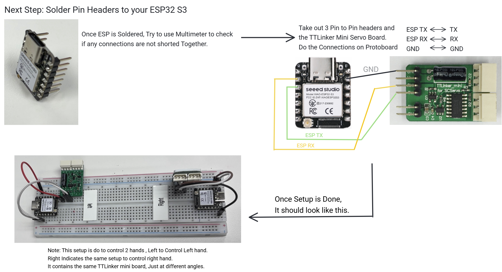
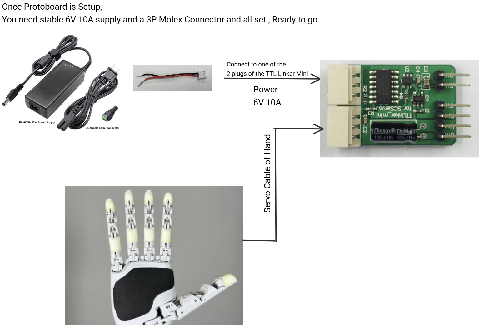
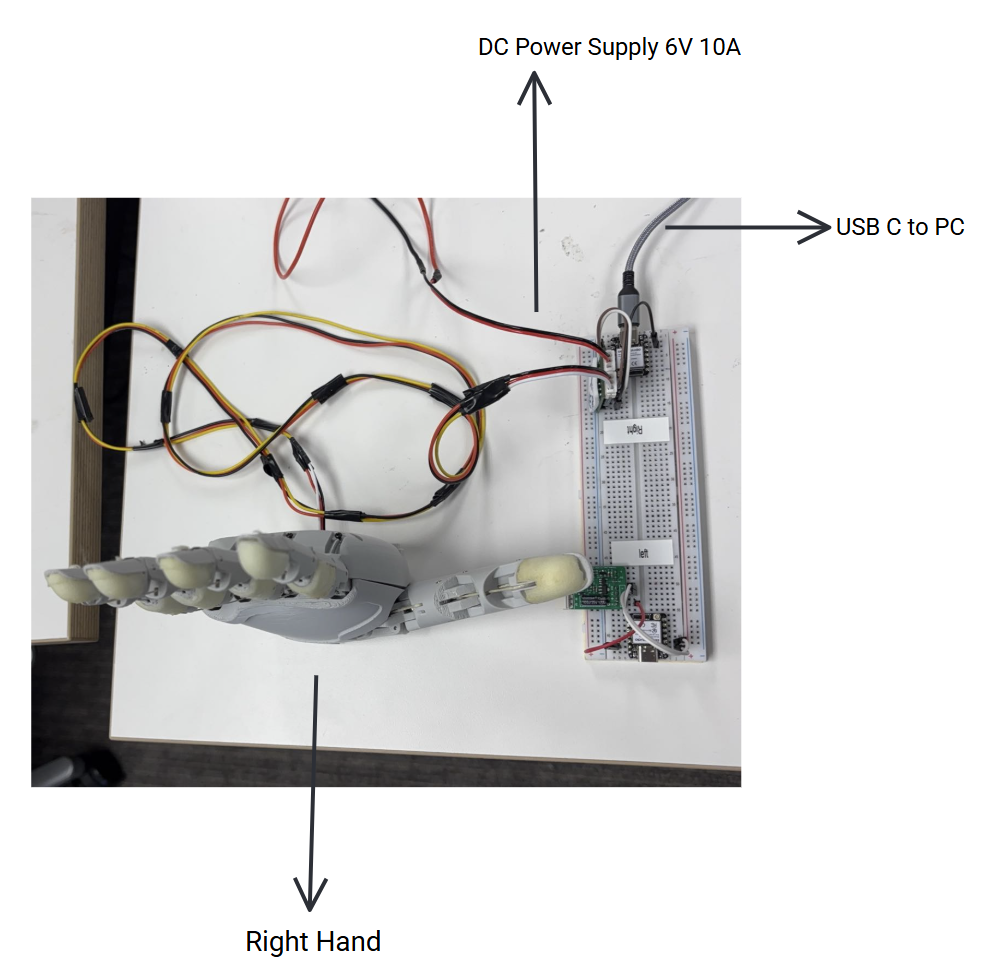
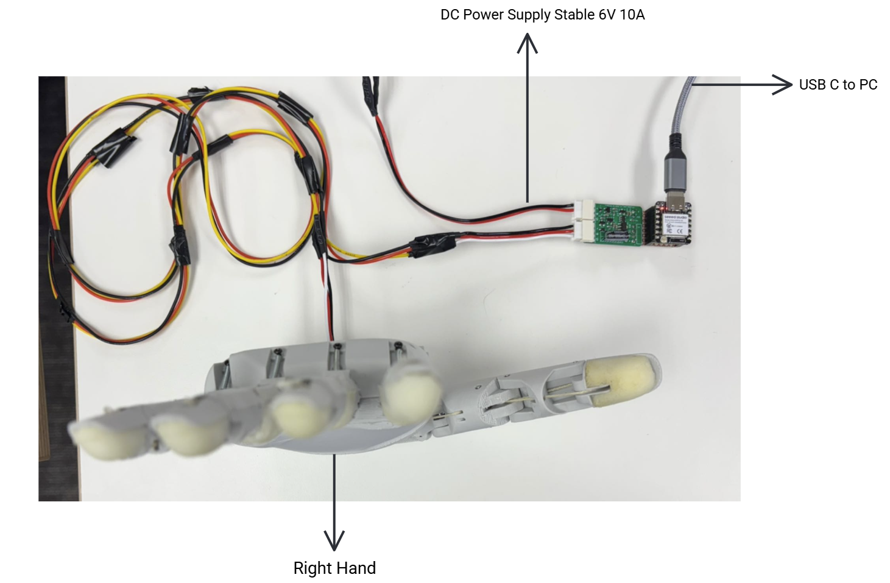
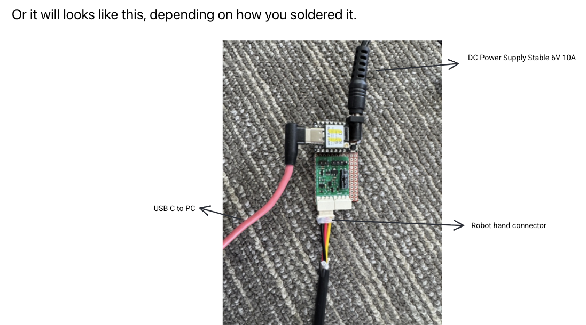

# Hardware Setup

This page contains the complete hardware setup connections guide for the Aero Hand.

### 🚀 **Option 1 (RECOMMENDED) - Plug & Play Solution**
> **⭐ EASIEST & FASTEST WAY TO GET STARTED**

**Buy our custom PCBs** (described above) from our [website](https://shop.tetheria.ai/products/pcbs) for a **plug-and-play solution**. 

✅ **Benefits:**
- **Zero soldering required** - just plug and play
- **Professional quality** - tested and verified PCBs
- **Self-explanatory connections** - cable connections are straightforward
- **Maximum reliability** - optimized for all motor currents
- **Time-saving** - get your hand running in minutes, not hours

🔗 **[Order PCBs Now →](https://shop.tetheria.ai/products/pcbs)**

### Option 2
If you prefer to manufacture and solder the PCBs yourself, all files and resources for self-manufacturing are provided in the [PCB](<https://github.com/TetherIA/aero-hand-open/tree/main/hardware/PCB>) folder.

### Option 3 
Use off-the-shelf protoboard and connectors (Molex 3-pin, JST) to manually wire and control the servos. This method requires careful soldering and wire management, and may not support maximum current for all motors. You will need:
- Protoboard
- Molex 3-pin connectors (for servos)
- JST connectors
- Servo cables
- Soldering tools

Once you have everything , You can refer to our guide under **Hardware Setup Guide** folder . Or you can also take a look at the next steps.

Step 1: Solder Pin Headers to ESP and do connections to TTLinker Mini Board.

Step2: Connect 6V 10A regulated power supply like below image

Step3: Once your setup is ready, It will look something like this.

**OR** if you want to do soldered connections on a board directly instead of using a protoboard, then your connections will look like this.

**OR** it will looks like this, depending on how you soldered it.

:::tip
If you have any questions, please reach out to our community on [Discord](https://discord.gg/ZQKWK7NebQ).
:::

Made with ❤️ by **TetherIA Robotics**

