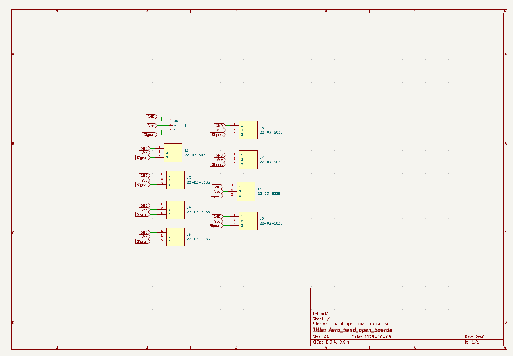
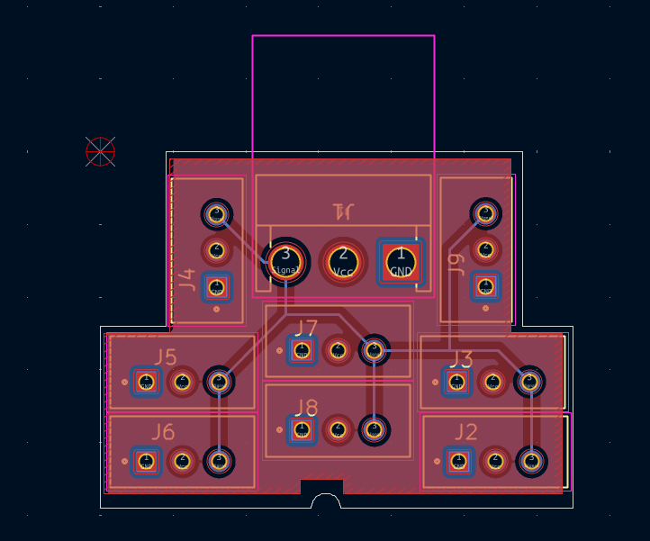
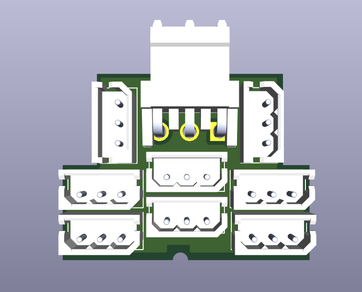
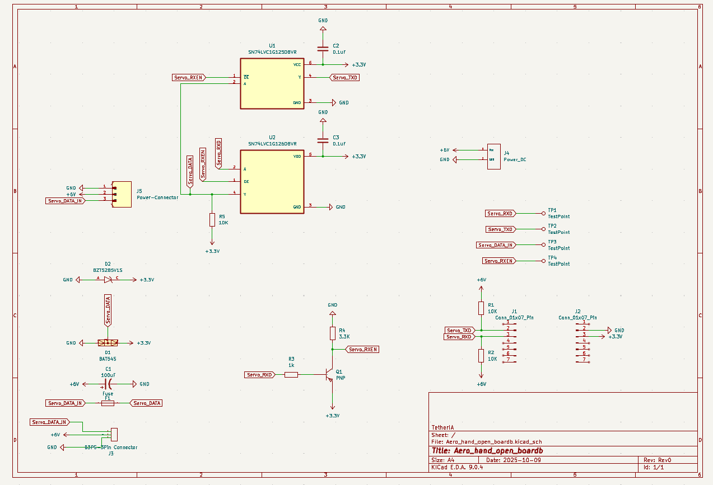
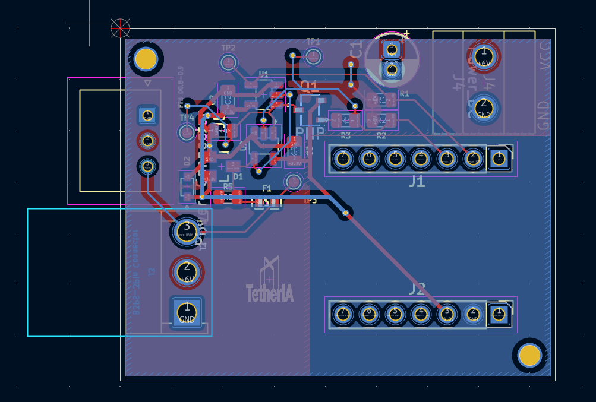
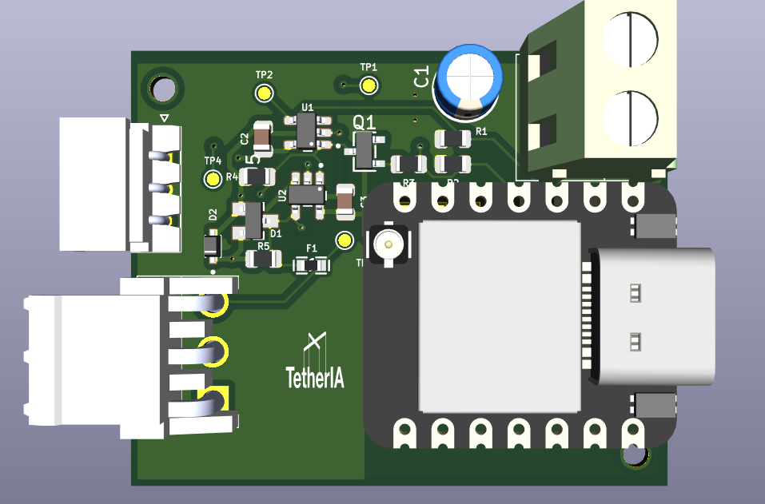

# PCB Overview

The Aero Hand consists of two custom PCB boards: **Board A** and **Board B**. All design files - including Gerber files, KiCad project files, BOM, and CPL - are available in our [GitHub Repository Link](<https://github.com/TetherIA/aero-hand-open/tree/main/hardware>).

---

## Board A
- Features **8 Molex connectors** for connecting all servos in the hand.
- Includes a **JST connector P3.96mm** for outer wiring and fitting inside the hand enclosure.
- Designed for compact integration and reliable servo connectivity.

## Board B
- Includes a **JST connector** and **one Molex connector** for testing individual servos and debugging.
- Features a **terminal block** to connect a regulated 6V, 10A power supply for the servos.
- Hosts the **ESP32-S3** microcontroller with a **USB-C port** for:
	- Powering the ESP32-S3
	- Communication between PC and ESP32-S3
	- Interfacing with the hand
- Board B is essential for diagnostics and safe power delivery.

---

For more details on communication and control, refer to our [SDK Documentation](https://github.com/TetherIA/aero-open-sdk).

Made with ❤️ by **TetherIA Robotics**

